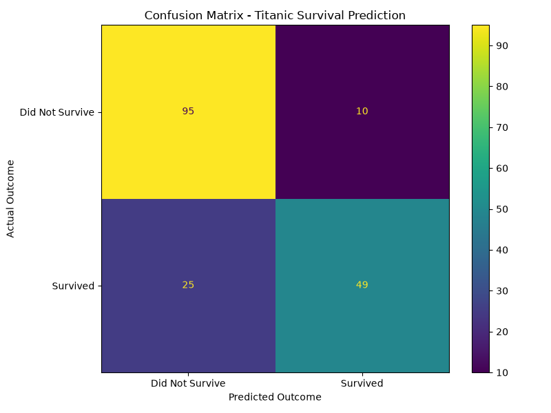
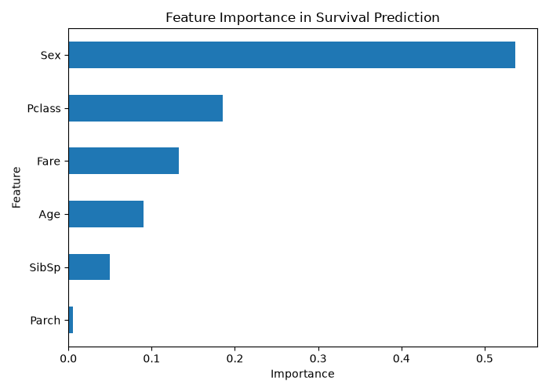

# Predictive Modeling Using Machine Learning

A machine learning project that predicts Titanic passenger survival using a Decision Tree Classifier.

## 🎯 Objective

The objective of this project is to build a supervised machine learning model that learns patterns from Titanic passenger data and predicts whether a passenger survived or did not survive.

## 🛠️ Technologies Used

- Python
- Pandas
- Matplotlib
- Scikit-learn

## 📊 Dataset

The project uses the Titanic dataset containing passenger information such as:

- Passenger Class
- Sex
- Age
- Number of Siblings/Spouses
- Number of Parents/Children
- Fare
- Survival status

## 🧹 Data Preprocessing

The dataset was prepared before training the model by:

- Handling missing Age values using the median
- Handling missing Embarked values using the mode
- Removing duplicate records
- Converting categorical values into numerical values

## 🤖 Machine Learning Model

A **Decision Tree Classifier** was used for prediction.

The dataset was divided into:

- **80% Training Data** – used to train the model
- **20% Testing Data** – used to evaluate the model

## 📈 Model Evaluation

The model was evaluated using:

- Accuracy
- Classification Report
- Confusion Matrix

### Confusion Matrix

The confusion matrix shows the number of correct and incorrect survival predictions made by the model.

### Feature Importance

The feature importance visualization shows which passenger attributes contributed most to the model's predictions.

## 📌 Key Outcomes

- Built a supervised machine learning model for survival prediction.
- Preprocessed the Titanic dataset before training.
- Trained a Decision Tree Classifier.
- Evaluated the model using accuracy and a confusion matrix.
- Visualized the importance of different features used by the model.

## 📂 Project Files

| File | Description |
|---|---|
| `Titanic-Dataset.csv` | Original Titanic dataset |
| `predictive_model.py` | Python machine learning code |
| `confusion_matrix.png` | Model evaluation visualization |
| `feature_importance.png` | Feature importance visualization |
| `requirements.txt` | Required Python libraries |

## 🎓 Learning Outcome

This project provided practical experience in data preprocessing, supervised machine learning, model evaluation, and visualization using Python.
